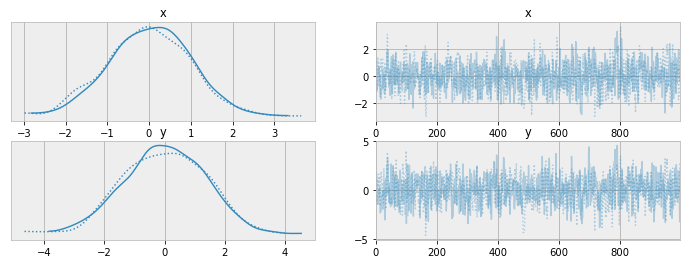
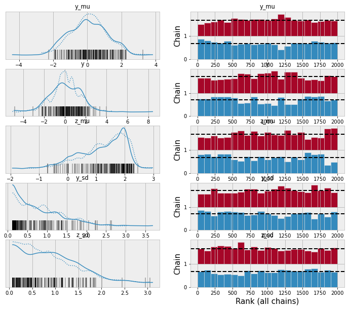
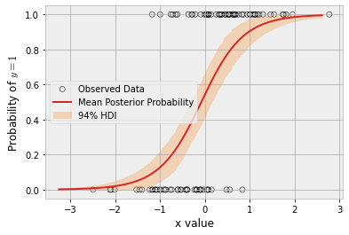

When people are starting to learn `pymc` they often assume the syntax and workflow for the library is something that's unchangeable. But thanks to the modular way the library is implemented, I'm going to show that it's fairly easy to use it in a totally different way!


```python
from functools import wraps
import numpy as np
import pymc as pm
```

## Sample as a method on the model

Some people see sampling as more a method on the model than a function. We can always extend `pm.Model` for those that find that more intuitive


```python
class Model(pm.Model):
    def sample(self, *args, **kwargs):
        return pm.sample(*args, model=self, **kwargs)

    def sample_posterior_predictive(self, *args, **kwargs):
        return pm.sample_posterior_predictive(*args, model=self, **kwargs)
```

Here is a simple example of it in action


```python
with Model() as basic_model:
    x = pm.Normal("x", 0., 1.)                                                                                                                                                                                                                                        
    y = pm.Normal("y", x, 1.)

idata = basic_model.sample(draws=1000)
```

## Models as parameterised functions

The idea here is to create models by just using a decorator. This change in practice removes all need to think about context managers


```python
def model(f):
    @wraps(f)
    def make_model(*args, **kwargs):
        with Model() as m:
            f(*args, **kwargs)
            return m
    return make_model
```

With this change our previous model becomes:


```python
@model
def basic_model(mu):
    x = pm.Normal("x", 0., 1.)                                                                                                                                                                                                                                        
    y = pm.Normal("y", x, 1.)
```


```python
m = basic_model(mu=0.)
idata = m.sample(draws=1000)
```

    Auto-assigning NUTS sampler...
    Initializing NUTS using jitter+adapt_diag...
    Multiprocess sampling (2 chains in 2 jobs)
    NUTS: [x, y]


<style>
    /* Turns off some styling */
    progress {
        /* gets rid of default border in Firefox and Opera. */
        border: none;
        /* Needs to be in here for Safari polyfill so background images work as expected. */
        background-size: auto;
    }
    .progress-bar-interrupted, .progress-bar-interrupted::-webkit-progress-bar {
        background: #F44336;
    }
</style>


<div>
  <progress value='4000' class='' max='4000' style='width:300px; height:20px; vertical-align: middle;'></progress>
  100.00% [4000/4000 00:02<00:00 Sampling 2 chains, 0 divergences]
</div>


    Sampling 2 chains for 1_000 tune and 1_000 draw iterations (2_000 + 2_000 draws total) took 3 seconds.
    We recommend running at least 4 chains for robust computation of convergence diagnostics


```python
pm.summary(idata)
```


<div>
<style scoped>
    .dataframe tbody tr th:only-of-type {
        vertical-align: middle;
    }

    .dataframe tbody tr th {
        vertical-align: top;
    }

    .dataframe thead th {
        text-align: right;
    }
</style>
<table border="1" class="dataframe">
  <thead>
    <tr style="text-align: right;">
      <th></th>
      <th>mean</th>
      <th>sd</th>
      <th>hdi_3%</th>
      <th>hdi_97%</th>
      <th>mcse_mean</th>
      <th>mcse_sd</th>
      <th>ess_bulk</th>
      <th>ess_tail</th>
      <th>r_hat</th>
    </tr>
  </thead>
  <tbody>
    <tr>
      <th>x</th>
      <td>0.004</td>
      <td>0.990</td>
      <td>-1.803</td>
      <td>1.834</td>
      <td>0.034</td>
      <td>0.024</td>
      <td>848.0</td>
      <td>932.0</td>
      <td>1.0</td>
    </tr>
    <tr>
      <th>y</th>
      <td>0.002</td>
      <td>1.386</td>
      <td>-2.435</td>
      <td>2.608</td>
      <td>0.046</td>
      <td>0.035</td>
      <td>898.0</td>
      <td>1167.0</td>
      <td>1.0</td>
    </tr>
  </tbody>
</table>
</div>


```python
pm.plot_trace(idata);
```


    

    


But the real composition happens with how readily helper methods can be used


```python
def hyperprior(name, **kwargs):
    mu = pm.Normal(name + "_mu", mu=0, sigma=1)
    sd = pm.HalfNormal(name + "_sd", sigma=1)
    return pm.Normal(name, mu=mu, sigma=sd, **kwargs)

@model
def model_with_helper():
    y = hyperprior("y")
    z = hyperprior("z", observed=2.)
```


```python
m = model_with_helper()
idata = pm.sample(model=m)
```

    Auto-assigning NUTS sampler...
    Initializing NUTS using jitter+adapt_diag...
    Multiprocess sampling (2 chains in 2 jobs)
    NUTS: [y_mu, y_sd, y, z_mu, z_sd]


<style>
    /* Turns off some styling */
    progress {
        /* gets rid of default border in Firefox and Opera. */
        border: none;
        /* Needs to be in here for Safari polyfill so background images work as expected. */
        background-size: auto;
    }
    .progress-bar-interrupted, .progress-bar-interrupted::-webkit-progress-bar {
        background: #F44336;
    }
</style>


<div>
  <progress value='4000' class='' max='4000' style='width:300px; height:20px; vertical-align: middle;'></progress>
  100.00% [4000/4000 00:06<00:00 Sampling 2 chains, 208 divergences]
</div>


    Sampling 2 chains for 1_000 tune and 1_000 draw iterations (2_000 + 2_000 draws total) took 6 seconds.
    We recommend running at least 4 chains for robust computation of convergence diagnostics


```python
pm.plot_trace(idata, kind="rank_bars");
```


    

    


And since the model return is an ordinary pymc model object, it can be readily used for things like posterior predictive checks


```python
y_data = np.random.normal(size=100)

@model
def ppc_model():
    x = pm.Normal("x")
    y = pm.Normal("y", x, 1., observed=y_data)
```


```python
m = ppc_model()
idata = pm.sample(draws=1000, model=m)
idata = pm.sample_posterior_predictive(trace=idata, model=m)
```

    Auto-assigning NUTS sampler...
    Initializing NUTS using jitter+adapt_diag...
    Multiprocess sampling (2 chains in 2 jobs)
    NUTS: [x]


<style>
    /* Turns off some styling */
    progress {
        /* gets rid of default border in Firefox and Opera. */
        border: none;
        /* Needs to be in here for Safari polyfill so background images work as expected. */
        background-size: auto;
    }
    .progress-bar-interrupted, .progress-bar-interrupted::-webkit-progress-bar {
        background: #F44336;
    }
</style>


<div>
  <progress value='4000' class='' max='4000' style='width:300px; height:20px; vertical-align: middle;'></progress>
  100.00% [4000/4000 00:02<00:00 Sampling 2 chains, 0 divergences]
</div>


    Sampling 2 chains for 1_000 tune and 1_000 draw iterations (2_000 + 2_000 draws total) took 2 seconds.
    We recommend running at least 4 chains for robust computation of convergence diagnostics
    Sampling: [y]


<style>
    /* Turns off some styling */
    progress {
        /* gets rid of default border in Firefox and Opera. */
        border: none;
        /* Needs to be in here for Safari polyfill so background images work as expected. */
        background-size: auto;
    }
    .progress-bar-interrupted, .progress-bar-interrupted::-webkit-progress-bar {
        background: #F44336;
    }
</style>


<div>
  <progress value='2000' class='' max='2000' style='width:300px; height:20px; vertical-align: middle;'></progress>
  100.00% [2000/2000 00:00<00:00]
</div>


```python
pm.plot_ppc(idata);
```

    /home/zv/upstream/miniconda3/envs/pymc4/lib/python3.9/site-packages/IPython/core/pylabtools.py:151: UserWarning: Creating legend with loc="best" can be slow with large amounts of data.
      fig.canvas.print_figure(bytes_io, **kw)


    

    


Finally, one underappreciated aspect of this functional approach to defining model is avoids the near for `pm.MutableData` for simpler models. Porting an [example](https://www.pymc.io/projects/examples/en/latest/fundamentals/data_container.html#applied-example-using-mutabledata-as-input-to-a-binomial-glm) from the documentation


```python
n_obs = 100
true_beta = 2.5
true_alpha = 0.25

x = np.random.normal(size=n_obs)
true_p = 1 / (1 + np.exp(-(true_alpha + true_beta * x)))
y = np.random.binomial(n=1, p=true_p)
```


```python
@model
def logistic_model(x, y):
    alpha = pm.Normal("alpha")
    beta = pm.Normal("beta")
    p = pm.Deterministic("p", pm.math.sigmoid(alpha + beta * x))
    obs = pm.Bernoulli("obs", p=p, observed=y, shape=x.shape[0])
```


```python
lm = logistic_model(x, y)
idata = lm.sample()

idata = lm.sample_posterior_predictive(
    idata, extend_inferencedata=True,
)
```

    Auto-assigning NUTS sampler...
    Initializing NUTS using jitter+adapt_diag...
    Multiprocess sampling (2 chains in 2 jobs)
    NUTS: [alpha, beta]


<style>
    /* Turns off some styling */
    progress {
        /* gets rid of default border in Firefox and Opera. */
        border: none;
        /* Needs to be in here for Safari polyfill so background images work as expected. */
        background-size: auto;
    }
    .progress-bar-interrupted, .progress-bar-interrupted::-webkit-progress-bar {
        background: #F44336;
    }
</style>


<div>
  <progress value='4000' class='' max='4000' style='width:300px; height:20px; vertical-align: middle;'></progress>
  100.00% [4000/4000 00:02<00:00 Sampling 2 chains, 0 divergences]
</div>


    Sampling 2 chains for 1_000 tune and 1_000 draw iterations (2_000 + 2_000 draws total) took 3 seconds.
    We recommend running at least 4 chains for robust computation of convergence diagnostics
    Sampling: [obs]


<style>
    /* Turns off some styling */
    progress {
        /* gets rid of default border in Firefox and Opera. */
        border: none;
        /* Needs to be in here for Safari polyfill so background images work as expected. */
        background-size: auto;
    }
    .progress-bar-interrupted, .progress-bar-interrupted::-webkit-progress-bar {
        background: #F44336;
    }
</style>


<div>
  <progress value='2000' class='' max='2000' style='width:300px; height:20px; vertical-align: middle;'></progress>
  100.00% [2000/2000 00:00<00:00]
</div>


We call the `logistic_model` function with different arguments changing to use `x_grid` instead of `x`


```python
grid_size = 250
x_grid = np.linspace(x.min(), x.max(), grid_size)
lm_grid = logistic_model(x_grid, y)
post_idata = lm_grid.sample_posterior_predictive(
    idata, var_names=["p", "obs"],
)
```

    Sampling: [obs]


<style>
    /* Turns off some styling */
    progress {
        /* gets rid of default border in Firefox and Opera. */
        border: none;
        /* Needs to be in here for Safari polyfill so background images work as expected. */
        background-size: auto;
    }
    .progress-bar-interrupted, .progress-bar-interrupted::-webkit-progress-bar {
        background: #F44336;
    }
</style>


<div>
  <progress value='2000' class='' max='2000' style='width:300px; height:20px; vertical-align: middle;'></progress>
  100.00% [2000/2000 00:00<00:00]
</div>


```python
fig, ax = plt.subplots()
hdi = az.hdi(post_idata.posterior_predictive.p).p

ax.scatter(x, y, facecolor="none", edgecolor="k", label="Observed Data")
p_mean = post_idata.posterior_predictive.p.mean(dim=["chain", "draw"])
ax.plot(x_grid, p_mean, color="tab:red", label="Mean Posterior Probability")
ax.fill_between(x_grid, *hdi.values.T, color="tab:orange", alpha=0.25, label="94% HDI")
ax.legend()
ax.set(ylabel="Probability of $y=1$", xlabel="x value")
plt.show()
```


    

    


While I personally think changes simplify the models and speed-up up the interactive workflow, that's not the main reason I share them. I share them because more of us should be doing little experiments like these. There are certainly more low-hanging fruits to be had with people are willing to join in!
